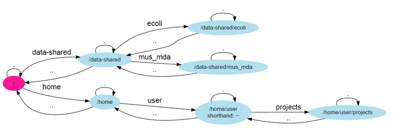

Unix - Basics
=============

This session will give you all the basics that you need
to smoothly move around when using a UNIX system (in the text mode!).

Basic orientation
-----------------

.. note::

   Copying and pasting in the Windows terminal (Git for Windows) is different
   than in other programs - especially because ``ctrl+c`` means to kill the current
   program. To **copy text to clipboard** just select it with your left mouse button.
   To **paste from clipboard** either click right mouse button, or press ``shift+insert``.

Check your keyboard
^^^^^^^^^^^^^^^^^^^

Before we do any serious typing, make sure you know where are the important keys.
I'd suggest using English keyboard, if you don't want to constantly press right alt
and five random letters before you find the one you need.
You will definitely need those keys::

  [] - square brackets
  {} - curly brackets (mustache)
  <> - angle brackets (less than, greater than)
  () - parentheses
  ~ - tilde
  / - slash
  \ - backslash
  | - pipe
  ^ - caret
  $ - dollar sign
  : - colon
  ; - semicolon
  . - dot
  , - comma
  # - hash, pound
  _ - underscore
  - - dash
  * - asterisk
  ! - exclamation mark
  ? - question mark
  & - ampersand
  @ - at sign
  ' - single quote
  " - double quote
  ` - back tick

Be safe when the network fails
^^^^^^^^^^^^^^^^^^^^^^^^^^^^^^
When you are disconnected from the machine due to any technical problems,
all your running programs are killed. To prevent this, we suggest to use
the ``screen`` tool for all your work::

  screen

To safely disconnect from a running screen press ``ctrl+a d`` (d for detach).
To attach again type::

  screen -r

.. note::

   Keyboard shortcuts notation: ``ctrl+a d`` means press ``ctrl`` key and ``a`` key
   simultaneously and ``d`` key after you release both of the previous keys.

Directory structure
^^^^^^^^^^^^^^^^^^^

Unlike 'drives' in MS Windows, UNIX has a single directory tree
that starts in ``/`` (called root directory). Everything can be reached from the root directory.
The next important directory is ``~`` (called user's home directory). It is
a shortcut for ``/home/user`` here, ``/home/..your login name..`` in general.

Your bash session has a `working directory` that can be changed with ``cd`` (change directory)
and printed with ``pwd`` (print working directory). All filenames and paths you
type refer to your working directory (relative paths), unless you start them with ``/`` (absolute paths).

Try the following commands in the order they are provided, and figure out what they do.
Then use your knowledge to explore the directory structure of the virtual machine.

Figure out what these commands do:

.. code-block:: bash

    pwd
    ls
    ls /
    ls ..
    ls ~
    cd
    cd /
    cd ..
    cd ~

A neat trick to go back where you've been before the last ``cd`` command:

.. code-block:: bash

  cd -

More in :ref:`moving_around`.

Moving or copying files and directories
^^^^^^^^^^^^^^^^^^^^^^^^^^^^^^^^^^^^^^^

.. code-block:: bash

  touch # make a file
  mkdir -p some/sub/directories # make nested directories
  rm -r # remove a file/directory
  mv # move a file/directory
  cp -r # copy a file/directory

.. code-block:: bash

  cd # Go to home directory
  mkdir projects/fastq # Make a new directory 'fastq'
  # Copy a fastq archive to the new directory
  cp /data-shared/fastq/fastq.tar.gz projects/fastq/.
  cd projects/fastq
  tar -zxvf fastq.tar.gz
  ls

Uncompressing files
^^^^^^^^^^^^^^^^^^^

.. code-block:: bash

  # Compressed tarball archives
  tar -xzvf fastq.tar.gz

  # gzipped files
  gunzip file.txt.gz

  # Open gzipped files in pipeline
  zcat file.txt.gz | less

Viewing plain text file content
^^^^^^^^^^^^^^^^^^^^^^^^^^^^^^^

.. code-block:: bash

  less -SN
  tail -n 5
  head -n 5
  cat
  nano

Pipes
^^^^^

Using the ``|`` (pipe) character you instruct the shell to take the output of the first command
and use it as an input for the second command.

The complement to ``head`` is ``tail``. It displays last lines of the input.
It can be readily combined with ``head`` to show the second sequence in the file.

.. code-block:: bash

    cd ~/projects/fastq
    < HRTMUOC01.RL12.00.fastq head -8 | tail -4 | less -S

Globbing
^^^^^^^^

Imagine you've got 40 FASTQ files instead of 3. You don't want to copy and paste all
the names! There is a feature that comes to rescue. It's called `globbing`. It allows
you to specify more filenames at once by defining some common pattern. All your
read files have ``.fastq`` extension. ``*.fastq`` means *a file named by any number of
characters followed by '.fastq'*.

.. code-block:: bash

cd ~/projets/fastq
cat HRTMUOC01.RL12.*.fastq | wc -l
expr XXXX / 4

cat HRTMUOC01.RL12.0?.fastq | wc -l
expr XXXX / 4

cat HRTMUOC01.RL12.0[1-9].fastq | wc -l
expr XXXX / 4

**Exercise (How many reads are there?)**:

We found out that FASTQ files have a particular structure (four lines per read).
To find the total number of reads in our data, we will use another tool, ``wc``
(stands for `word count`, not for a toilet at the end of the pipeline;). ``wc``
counts words, lines and characters.

Our data is in three separate files. To merge them on the fly we'll use another tool,
``cat`` (for conCATenate). ``cat`` takes a list of file names and outputs a continuous
stream of the data that was in the files (there is no way to tell where one file ends
from the stream).

# now double click on each file name in the listing,
# and click right mouse button to paste (insert space in between)

.. code-block:: bash

  cat *.fastq | wc -l

The number that appeared is four times the number of sequences (each sequence takes
four lines). And there is even a built-in calculator in bash:

.. code-block:: bash

  echo $(( 788640 / 4 ))
  expr XXXX / 4

Variables/Lists
^^^^^^^^^^^^^^^

.. code-block:: bash

  CPU=4
  echo $CPU

  FILE=~/projects/fastq/HRTMUOC01.RL12.00.fastq
  echo $FILE

.. code-block:: bash

  echo file{1..9}.txt
  LST=$( echo file{1..9}.txt )
  echo $LST

  LST2=$(ls ~/projects/fastq/*.fastq)
  echo $LST2

Loops
^^^^^

.. code-block:: bash

  LST=$(ls ~/projects/fastq/HRTMUOC01.RL12.*.fastq)

  for I in $LST
  do
    echo $I;
    head -1 $I | wc -c;
  done

Installing software
-------------------

The easiest way to install software is via a package manager (eg. ``apt-get`` for all Debian
variants). When the required software is not in the repositories, or one needs the latest
version, it's necessary to take the more difficult path. The canonical UNIX way is::

  wget -O - ..url.. | tar xvz   # download and unpack the 'tarball' from internet
  cd ..unpacked directory..     # set working directory to the project directory
  ./configure                   # check your system and choose the way to build it
  make                          # convert source code to machine code (compile it)
  sudo make install             # copy the results to your system

.. note::

   Normal users cannot change (and break) the (UNIX) system. There is one special
   user in each system called ``root``, who has the rights to make system wide changes.
   You can either directly log in as root, or use ``sudo`` (super user do) to execute
   one command as ``root``.

   .. image:: _static/sandwich.png
      :align: center

htop
^^^^

Installing software from common repository:

.. code-block:: bash

  sudo apt-get install htop

Bedtools
^^^^^^^^

Install software which is not in the common repository. You just need to find
a source code and compile it:

.. code-block:: bash

  wget https://github.com/arq5x/bedtools2/releases/download/v2.25.0/bedtools-2.25.0.tar.gz
  tar -zxvf bedtools-2.25.0.tar.gz
  cd bedtools2
  make

Another common place where you find a lot of software is `GitHub`. We'll install
``bedtools`` from a GitHub repository:

.. code-block:: bash

  cd ~/sw

  # get the latest bedtools
  git clone https://github.com/arq5x/bedtools2

This creates a `clone` of the online repository in ``bedtools2`` directory.

.. code-block:: bash

   cd bedtools2
   make

Exercise
--------

.. note::

  1. What is the output of this command ``cd ~/ && ls | wc -l``?

    a) The total count of files in subdirectories in home directory
    b) The count of lines in files in home directory
    c) The count of files/directories in home directory
    d) The count of files/directories in current directory

  2. How many directories this command ``mkdir {1999..2001}-{1st,2nd,3rd,4th}-{1..5}`` makes?

    a) 56
    b) 60
    c) 64
    d) 72

  3. When files created using this command ``touch file0{1..9}.txt file{10..30}.txt``, how many files matched by ``ls file?.txt`` and ``ls file*0.txt``

    a) 30 and 0
    b) 0 and 30
    c) 30 and 4
    d) 0 and 3

  4. Which file would match this pattern ``ls *0?0.*``?

    a) file36500.tab
    b) file456030
    c) 5460230.txt
    d) 456000.tab

  5. Where do we get with this command ``cd ~/ && cd ../..``?

    a) two levels below home directory
    b) one level above home directory
    c) to root directory
    d) two levels above root directory

  6. What number does this command ``< file.txt head -10 | tail -n+9 | wc -l`` print? (Assume the file.txt contains a lot of lines)

    a) 0
    b) 1
    c) 2
    d) 3
