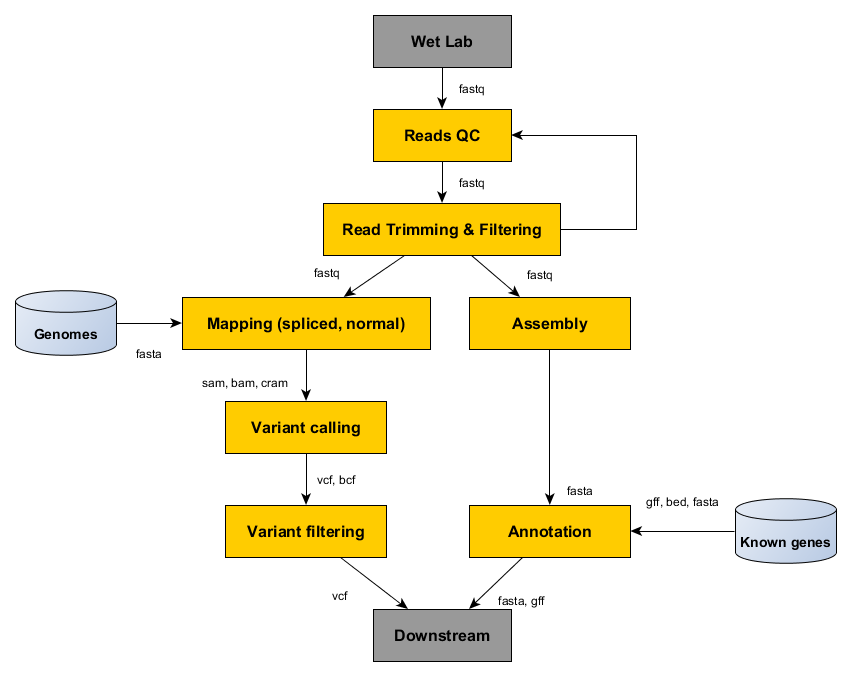

Session 2: Genomic data
=======================

During this course we are going to use various genomic data stored in standard formats 
that can be easily read and processed with UNIX shell commands. This session provides 
overview of these common data formats. Specialized tools that are optimized for work 
with these data will be mentioned here as well. 

Complex tasks are more easy to be conducted with specialized genomic tools rather 
than trying to achieve that solely by using built-in UNIX command line tools. 
Not mentioning here very specific bioinformatic tasks like read mapping, 
assembly and others that simply need a software developed for such purposes.

The advantage is that majority of the specialized genomic software can be run 
in the command line. The most efficient work is based on combination of both 
built-in UNIX shell commands and specialized genomic tools. Built-in UNIX shell 
commands can be used to direct flow of the data in the bioinformatic pipeline, 
carry basic processing of the data, and run genomic tools with specified parameters.

Common genomic tools
--------------------

Below is the list of the most widely used genomic tools that can be used for genomic data
processing based on type of task that they carry:

Read alignment data
^^^^^^^^^^^^^^^^^^^
 - samtools (https://samtools.github.io)

Variant data
^^^^^^^^^^^^
 - vcftools (https://vcftools.github.io/index.html)
 - bcftools (https://samtools.github.io/bcftools/)

Annotation data (genome arithmetics)
^^^^^^^^^^^^^^^^^^^^^^^^^^^^^^^^^^^^
 - bedtools (https://bedtools.readthedocs.io/en/latest/)
 - bedops (https://github.com/bedops/bedops)

Sequence/Alignment/Tree data
^^^^^^^^^^^^^^^^^^^^^^^^^^^^
 - newick-utilities (https://github.com/tjunier/newick_utils/wiki)
 - BuddySuite (https://github.com/biologyguy/BuddySuite)

Standard genomic data formats
-----------------------------

High throughput specs hub: https://samtools.github.io/hts-specs/

FASTQ - Short reads
^^^^^^^^^^^^^^^^^^^
Sequencing instruments produce not only base calls, but usually can assign
some quality score to each called base. Fastq contains multiple sequences, and
each sequence is paired with quality scores for each base. The quality scores
are encoded in text form.

  - http://maq.sourceforge.net/fastq.shtml

SAM - Reads mapped to reference
^^^^^^^^^^^^^^^^^^^^^^^^^^^^^^^
SAM stands for Sequence Alignment/Mapping format. It includes parts of the
original reads, that were mapped to a reference genome, together with the
position where they belong to. There is an effective binary encoded
counterpart called **BAM** and even more compressed **CRAM**.

  - http://samtools.github.io/hts-specs/SAMv1.pdf
  - https://samtools.github.io/hts-specs/CRAMv3.pdf

BED and GFF - Annotations
^^^^^^^^^^^^^^^^^^^^^^^^^
Annotations are regions in given reference genome with some optional
additional information. BED is very simple and thus easy to work with for
small tasks, GFF (General Feature Format) is a comprehensive format allowing
feature nesting, arbitrary data fields for each feature and so on.

  - http://genome.ucsc.edu/FAQ/FAQformat.html#format1
  - http://www.ensembl.org/info/website/upload/gff.html

VCF - Variants in individuals
^^^^^^^^^^^^^^^^^^^^^^^^^^^^^
VCF stands for Variant Call Format. Given a reference and a set of sequenced
individuals, VCF is a format to store the differences in these individuals,
compared to the reference, efficiently. There is also a binary counterpart
BCF.

  - http://samtools.github.io/hts-specs/VCFv4.2.pdf
