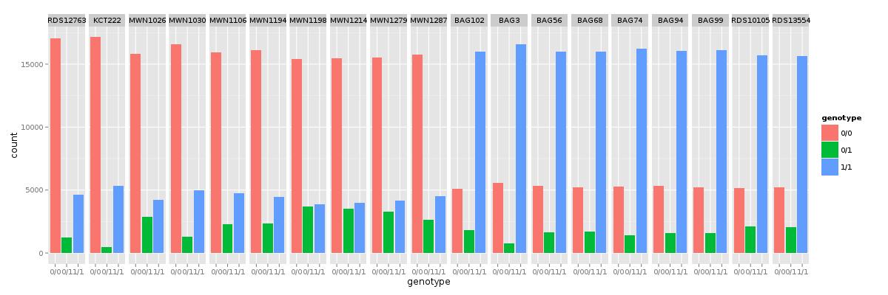

Graphics session
================
.. pull-quote:: A picture is worth a thousand words. 

Especially when your data is big. We'll try to show you one of the easiest
ways to get nice pictures from  your UNIX. We'll be using R, but we're not
trying to teach you R. R Project is huge, and mostly a huge mess. We're cherry
picking just the best bits;)

Summarization
^^^^^^^^^^^^^
R is best for working with 'tables'. That means data, where each line 
contains the same amount of 'fields', delimited by some special character
like ``;`` or ``<tab>``. The first row can contain column names. VCF is 
almost a nice tabular file. The delimiter is ``<tab>``, but there is some mess
in the beginning of the file::

  </data/mus_mda/00-popdata/popdata_mda_euro.vcf less -S

Prepare the input file
----------------------
We want to get rid of the comment lines starting with ``##``, and keep the 
line starting with ``#`` as column names (getting rid of the ``#`` itself):

.. code-block:: bash

   # create a new 'project' directory in data
   mkdir ~/data/plotvcf

   # we'll be reusing the same long file name, store it into a variable
   IN=/data/mus_mda/00-popdata/popdata_mda_euro.vcf

   # get rid of the '##' lines (quotes have to be there, otherwise
   # '#' means a comment in bash)
   <$IN grep -v '##' | less -S

   # good, now trim the first #
   <$IN grep -v '##' | tail -c +2 | less -S

   # all looks ok, store it (tsv for tab separated values)
   <$IN grep -v '##' | tail -c +2 > ~/data/plotvcf/popdata_mda_euro.tsv

Now we will switch to R Studio. You can just click here: `Open RStudio <http://localhost:8787>`_.

In R Studio choose ``File > New file > R Script``. R has a working directory as well.
You can change it with ``setwd``. Type this code into the newly created file::

  setwd('~/data/plotvcf')

With the cursor still in the ``setwd`` line, press ``ctrl+enter``. This copies the command
to the console and executes it. Now press ``ctrl+s``, and save your script as ``plots.R``.
It is a better practice to write all your commands in the script window, and execute with 
``ctrl+enter``. You can comment them easily, you'll find them faster...

Load and check the input
------------------------
Tabular data is loaded by ``read.table`` and it's shorthands. On a new line, type
``read.table`` and press ``F1``. Help should pop up. We'll be using the ``read.delim`` 
shorthand, that is preset for loading ``<tab>`` separated data with US decimal separator::

  d <- read.delim('popdata_mda_euro.tsv')

A new entry should show up in the 'Environment' tab. Click the arrow and explore. Click the 
'd' letter itself.

You can see that ``CHROM`` was encoded as a number only and it was loaded as
``integer``. But in fact it is a factor, not a number (remember e.g.
chromosome X). Fix this in the ``read.delim`` command, loading the data again
and overwriting `d`. The plotting would not work otherwise::

  d <- read.delim('popdata_mda_euro.tsv', colClasses=c("CHROM"="factor"))

First plot
----------

We will use the ``ggplot2`` library. The 'grammatical' structure of the
command says what to plot, and how to represent the values. Usually the
``ggplot`` command contains the reference to the data, and graphic elements
are added  with ``+ geom_..()``. There are even some sensible defaults - e.g.
``geom_bar`` of a factor sums the observations for each level of the factor::

  library(ggplot2)
  ggplot(d, aes(CHROM)) + geom_bar()

This shows the number of variants in each chromosome. You can see here, that
we've included only a subset of the data, comprising chromosomes 2 and 11.

Summarize the data
------------------
We're interested in variant density along the chromosomes. We can simply
break the chromosome into equal sized chunks, and count variants in each of them
as a measure of density.

There is a function ``round_any`` in the package ``plyr``, which given
precision rounds the numbers. We will use it to round the variant position to
1x10^6 (million base pairs), and then use this rounded position as the block
identifier. Because the same positions repeat on each chromosome, we need to
calculate it once per each chromosome. This is guaranteed by ``group_by``.
``mutate`` just adds a column to the data.

You're already used to pipes from the previous exercises. While it's not
common in R, it is possible to build your commands in a similar way thanks to
the ``magrittr`` package. The name of the package is an homage to the Belgian
surrealist René Magritte and his most popular painting.

.. figure:: _static/magritte.jpg
   :align: center
   
   Ceci n'est pas une pipe. This is not a pipe.

Although the magrittr ``%>%`` operator is not a pipe, it behaves like one. You
can chain your commands like when building a bash pipeline:

.. code-block:: r

   library(plyr)
   library(dplyr)

   dc <- d %>% group_by(CHROM) %>% mutate(POS_block=round_any(POS, 1e6))

   # the above command is equivalent to 
   dc <- mutate(group_by(d, CHROM), POS_block=round_any(POS, 1e6))

Now you can check how the ``round_any`` processed the ``POS`` value. Click the
``dc`` in the **Environment** tab and look for ``POS_block``. Looks good, we can go on.
The next transformation is to count variants (table rows) in each block (per chromosome):
You can use ``View`` in R Studio as ``less`` in bash.
.. code-block:: r

   dc %>%
    group_by(CHROM, POS_block) %>%
    summarise(nvars=n()) %>% 
    View

.. note:: To run the whole block at once with ``ctrl+enter``, select it before you press the shortcut.

If the data look like you expected, you can go on to plotting:

.. code-block:: r

   dc %>%
     group_by(CHROM, POS_block) %>%
     summarise(nvars=n()) %>% 
     ggplot(aes(POS_block, nvars)) + 
       geom_line() +
       facet_wrap(~CHROM, ncol = 1)

Now you can improve your plot by making the labels more comprehensible:

.. code-block:: r

   dc %>%
     group_by(CHROM, POS_block) %>%
     summarise(nvars=n()) %>% 
     ggplot(aes(POS_block, nvars)) + 
       geom_line() +
       facet_wrap(~CHROM, ncol = 1) + 
       ggtitle("SNP denisty per chromosome") + 
       ylab("number of variants") + 
       xlab("chromosome position")

If you prefer bars instead of a connected line, it's an easy swap with ggplot.

.. code-block:: r

   dc %>%
     group_by(CHROM, POS_block) %>%
     summarise(nvars=n()) %>% 
     ggplot(aes(POS_block, nvars)) + 
       geom_bar(stat="identity") +
       facet_wrap(~CHROM, ncol = 1) + 
       ggtitle("SNP denisty per chromosome") + 
       ylab("number of variants") + 
       xlab("chromosome position")

The ``stat="identity"`` is there, because ``geom_bar`` counts the rows otherwise.
This could have saved us some more typing:

.. code-block:: r

   ggplot(d, aes(POS)) + 
     geom_bar() +
     facet_wrap(~CHROM, ncol = 1) + 
     ggtitle("SNP denisty per chromosome") + 
     ylab("number of variants") + 
     xlab("chromosome position")

``ggplot`` warned you in the **Console**::

  stat_bin: binwidth defaulted to range/30. Use 'binwidth = x' to adjust this.

You can use ``binwidth`` to adjust the width of the bars, setting it to 1x10^6
again:

.. code-block:: r

   ggplot(d, aes(POS)) + 
     geom_bar(binwidth=1e6) +
     facet_wrap(~CHROM, ncol = 1) + 
     ggtitle("SNP denisty per chromosome") + 
     ylab("number of variants") + 
     xlab("chromosome position")

Tidy data
^^^^^^^^^

To create plots in such a smooth way like in the previous example the data has
to loosely conform to some simple rules. In short - each column is a variable,
each row is an observation. You can find more details in the 
`Tidy data <http://vita.had.co.nz/papers/tidy-data.html>`_ paper.
There is an R package ``tidyr`` that helps you to get the data into the required
shape.

The vcf is `tidy` when using the ``CHROM`` and ``POS`` variables. Each variant (SNP)
is a row. The data is not tidy regarding variants in particular individuals.
Individual identifier is a variable for this case, but it is stored as column name.
This is not 'wrong', this format was chosen so the data is smaller. But it does not work 
well with ggplot.

Now if we want to look at genotypes per individual, we need the genotype as a
single  variable, not 18. ``gather`` takes the values from multiple columns
and gathers them into one column. It creates another column where it stores
the originating column name for each value.

.. code-block:: r

   library(tidyr)
   dm <- d %>% gather(individual, genotype, 10:28 )

Look at the data. Now we can plot the counts of reference/heterozygous/alternative
alleles.

.. code-block:: r

   ggplot(dm, aes(genotype, fill=genotype)) + geom_bar()

And it is very easy to do it for each individual separately:

.. code-block:: r

   ggplot(dm, aes(genotype, fill=genotype)) +
     geom_bar() +
     facet_wrap(~individual, nrow=1)

Now try to change parts of the command to see the effect of various parts. Delete
``, fill=genotype`` (including the comma), execute. Then delete ``, nrow=1``, execute.
