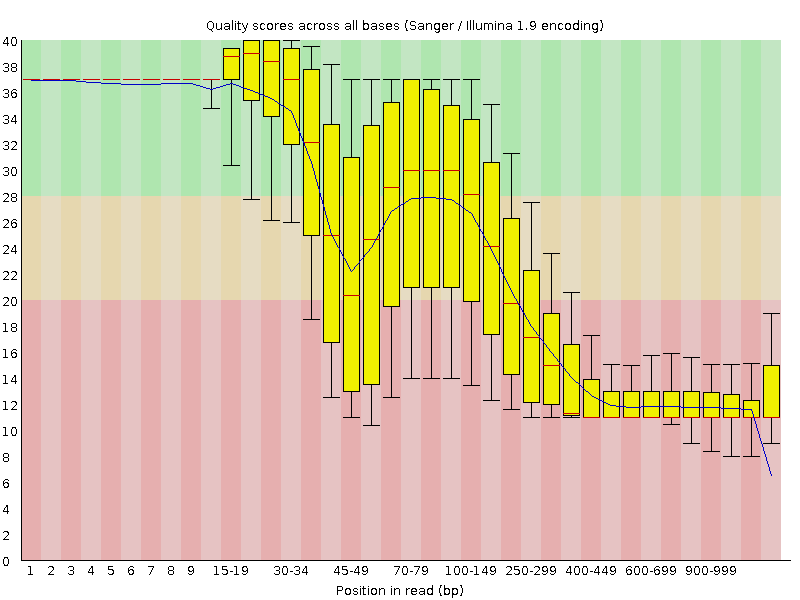
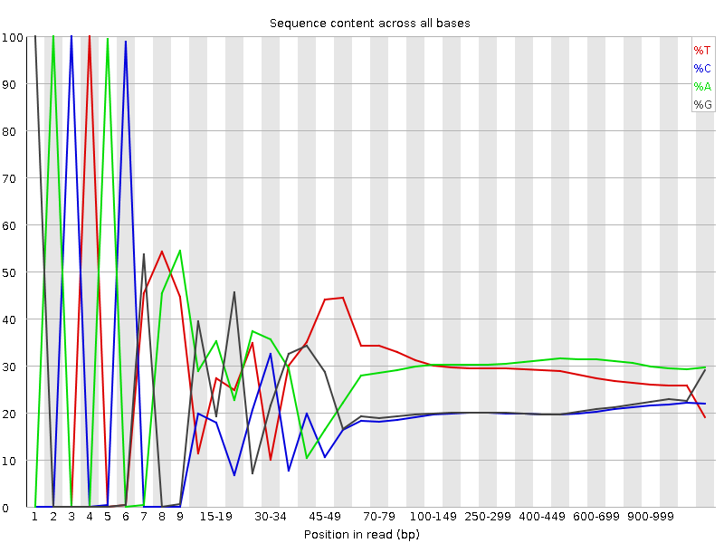
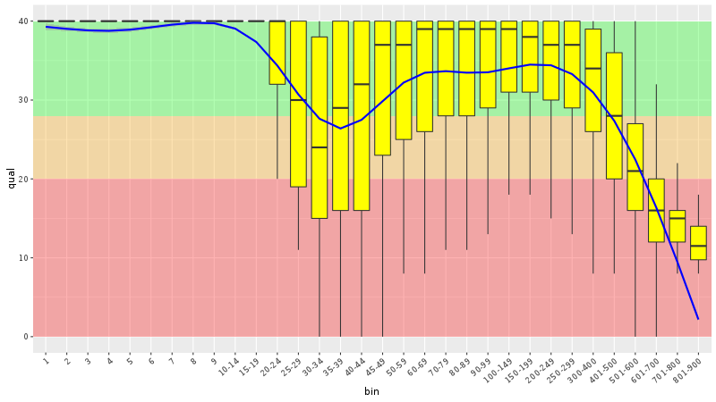

Session 6: Read quality
=======================

Many steps of genomic data processing have some associated quality value for
their results. Here we will briefly check the first and last of those. But
there is no simple way to set your quality thresholds. You have to recognize
completely bad data. But after that there is a continuum. Sometimes you just
need an idea of the underlying biology. Find some variants for further
screening. Sometimes you're trying to pinpoint particular variant causing a
disease.

Each read that comes out of the (now common) sequencing machines like Illumina
or Ion Torrent has a quality score assigned with each of the bases. This is not
true for the upcoming NanoPore or almost forgotten SOLiD machines, that are reading
more bases a time.

Phred encoding
--------------
The quality in Fastq files is encoded in `Phred quality score
<http://en.wikipedia.org/wiki/Phred_quality_score>`_, a number on a
logarithmic scale, similar to decibels.

  +---------------+-----------------------+
  | Phred quality | Probability of error  |
  +---------------+-----------------------+
  |            20 | 1 in 100              |
  +---------------+-----------------------+
  |            40 | 1 in 10,000           |
  +---------------+-----------------------+
  |            60 | 1 in 1,000,000        |
  +---------------+-----------------------+

Each Phred number is in turn encoded as a single character, so there is
straightforward mapping between the bases and the quality scores. The
most common mapping is ``Phred+33``::

  !"#$%&'()*+,-./0123456789:;<=>?@ABCDEFGHIJ
  | |                       |    |         |
  0.2......................26...31........41

FastQC
------
FastQC is a nice tool that you run with your data and get nice graphical
reports on the quality. It is not completely installed in your images,
so you can try to run a tool that was just unpacked (this is how this
tool is distributed, there is no install script - a daily bread of a
bioinformatician;). You have to use the full path to the tool to run it:

.. code-block:: bash

   # make a project directory for the qualities
   cd
   mkdir -p projects/quality
   cd projects/quality
   mkdir 00-reads
   </data-shared/fastq/fastq.tar.gz tar xz -C 00-reads

   mkdir 01-quality
   ~/sw/FastQC/fastqc -o 01-quality --noextract 00-reads/HRTMUOC01.RL12.01.fastq

Now transfer the ``.html`` files from the virtual machine to yours.
Open the files on your machine. You should see a report with plots
like this:

Parsing Fastq and decoding Phred
--------------------------------
To understand better what is in the FastQC plots, we will try to reproduce the
plots using Unix and ggplot. You should be able to understand the
following pipeline, at least by taking it apart with the help of head or less.
A brief description:

- ``paste`` merges every four lines into one
- ``awk`` selects only reads longer than 50 bases
- ``sed`` replaces the leading '@' with an empty string
- ``head`` takes first 1,000 sequences
- ``awk`` creates a Phred decoding table in ``BEGIN`` section,
  then uses the table (``quals``) to decode the values,
  outputs one row for each base (see 'tidy data')

.. code-block:: bash

    mkdir 02-quality-handmade
    IN=00-reads/HRTMUOC01.RL12.01.fastq

    <$IN paste - - - - |
      awk 'length($2) > 50' |
      sed 's/^@//' |
      head -1000 |
      awk 'BEGIN {
             OFS="\t";
             for(i = 33; i < 127; i++) quals[sprintf("%c", i)] = i - 33;
           }
           {
             l = length($2)
             for(i = 1; i <= l; i++) {
               print $1, i, l - i, substr($2, i, 1), quals[substr($4, i, 1)];}
           }'\
    > 02-quality-handmade/quals.tsv

Quality by position
-------------------
The first of the FastQC plots shows a summary of base qualities
according to position in the read. But it does not show quality scores
for all possible positions, they are grouped into classes of similar importance.
The further the base in the read, the bigger the group.

Fire up `R Studio <http://localhost:8787>`_ by clicking the link.
Create a file where your plotting code will live, ``File > New file > R Script``,
move to the directory where you're working now (don't forget to use tab completion)::

  setwd('~/projects/quality')

Now save it as ``plots.R``. (Doing setwd first offers the correct directory to save the file.)

First we will read in the data.

.. code-block:: r

  library(tidyverse)
  read_tsv("02-quality-handmade/quals.tsv",
           col_names=c("seq", "pos", "end_pos", "base", "qual")) ->
           d

We did not include column names in the data file, but it is easy to provide
them  during the load via ``col_names`` argument. Let's look at base quality
values for first  10 sequences:

.. code-block:: r

  d$seq %>% unique %>% head(10) -> sel
  d %>%
    filter(seq %in% sel) %>%
    ggplot(aes(pos, qual, colour = seq, group = seq)) +
    geom_line()

The qualities on sequence level don't seem to be very informative. They're
rather noisy. A good way to fight noise is aggregation. We will aggregate the
quality values using boxplots and for different position regions. First set up
the intervals:

.. code-block:: r

  # fastqc uses bins with varying size:
  # 1-9 by one, up to 75 by 5, up to 300 by 50, rest by 100

  c(0:9,
    seq(14, 50, by = 5),
    seq(59, 100, by = 10),
    seq(149, 300, by = 50),
    seq(400, 1000, by=100)) ->
    breaks

  # create nice labels for the intervals
  data.frame(
      l = breaks %>% head(-1),
      r = breaks %>% tail(-1)) %>%
    mutate(
      diff = r - l,
      lab = ifelse(diff > 1, paste0(l + 1, "-", r), as.character(r))) ->
    labs

Check the ``breaks`` and ``labs`` variables. In the FastQC plot there are vertical quality zones,
green, yellow and red. To replicate this, we need the values of the limits:

.. code-block:: r

    # data for quality zones
    data.frame(
        ymin = c(0, 20, 28),
        ymax = c(20, 28, 40),
        colour=c("red", "orange", "green")) ->
      quals

    # check if the quality zones look reasonably
    ggplot(quals, aes(ymin=ymin, ymax=ymax, fill=colour)) +
      geom_rect(alpha=0.3, xmin=-Inf, xmax=Inf) +
      scale_fill_identity() +
      scale_x_discrete()

Now we can use the breaks to create position bins:

.. code-block:: r

    d %>%
      mutate(bin=cut(pos, breaks, labels = labs$lab)) ->
      dm

    # plot the qualities in the bins
    ggplot(dm, aes(bin, qual)) +
      geom_boxplot(outlier.colour = NA) +
      ylim(c(0, 45))

Zones and boxplots look ok, we can easily combine those two into one plot.
That's pretty easy with ggplot. We use ``theme`` to rotate the x labels, so
they're all legible. In real world application the qualities are binned first,
and then the statistics are calculated on the fly, so it is not necessary to
load all the data at once.

.. code-block:: r

    ggplot(dm) +
      geom_rect(aes(ymin = ymin, ymax = ymax, fill = colour),
                xmin = -Inf,
                xmax = Inf,
                alpha=0.3,
                data = quals) +
      scale_fill_identity() +
      geom_boxplot(aes(bin, qual), outlier.colour = NA, fill = "yellow") +
      geom_smooth(aes(bin, qual, group = 1), colour = "blue") +
      theme(axis.text.x = element_text(angle = 40, hjust = 1))

Now we can do the base frequency plot. We already have the position bins,
so just throw ggplot at it::

  ggplot(dm, aes(bin, fill = base)) + geom_bar()

We're almost there, just need to normalize the values in each column so they
sum up to 1. Ggplot can do it for us::

  ggplot(dm, aes(bin, fill = base)) + geom_bar(position = "fill")

If you still want to get the line chart, you need to calculate the relative frequencies
yourself:

.. code-block:: r

  dm %>%
    group_by(bin, base) %>%
    summarise(count = n()) %>%
    group_by(bin) %>%
    mutate(`relative frequency` = count / sum(count)) ->
    dfreq

  dfreq %>%
    ggplot(aes(bin, `relative frequency`, colour = base, group = base)) +
    geom_line(size = 1.3)

What is better about the bar chart, and what is better about the line chart?

FastQC exercise
---------------

.. topic:: Hands on!

  Now run the FastQC quality check for all reads in ``00-reads``. Write the commands on your own.
  Use `globbing patterns`! Or try to write an alternative command with ``find`` and ``parallel``.

.. note::

  When checking quality of multiple fastq files, there is `MultiQC
  <http://multiqc.info/>`_ - it takes the output of multiple FastQC runs and
  generates a nice summary. You can try to run MultiQC as a homework::

    # run the multiqc on the fastqc results
    multiqc -o 03-multiqc 01-quality
