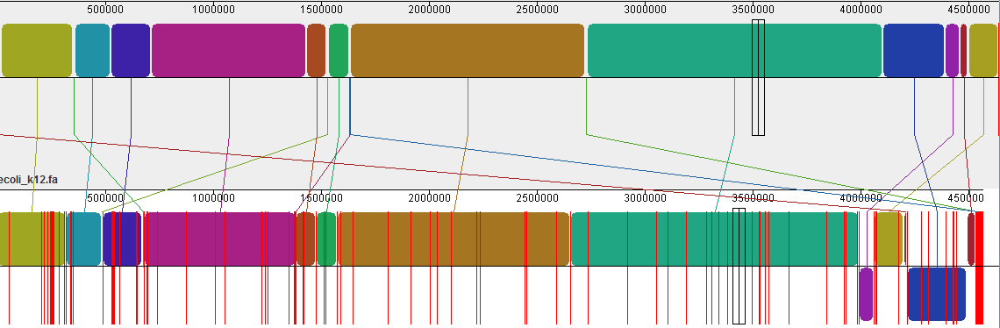

Genome assembly
===============

We'll be assembling a genome of *E. coli* from paired Illumina reads. We're
using ``Velvet``, which is a bit obsolete, but nice for teaching purposes.
Runs quite fast and does not consume that much memory. State-of-the art
assembler today is for example `Spades <http://cab.spbu.ru/software/spades/>`_.

.. code-block:: bash

  mkdir -p ~/projects/assembly
  cd ~/projects/assembly

  # link the shared data to current project (no copying)
  ln -s /data-shared/ecoli/reads 00-reads

  # look what's around
  ll

Velvet is used in two phases, the first phase prepares the reads, the second
phase  does the assembly itself. Open the `Velvet manual
<https://www.ebi.ac.uk/~zerbino/velvet/Manual.pdf>`_. When using anything more
complex than a Notepad you will actually save your time by reading the
manual. Surprised?;)

Also - run ``screen`` at this point, because you want to continue working,
while Velvet will be blocking one of the consoles.

.. code-block:: bash

  # load and prepare the reads
  velveth 03-velvet-k21 21 -fastq -short -separate 00-reads/MiSeq_Ecoli_MG1655_50x_R1.fastq 00-reads/MiSeq_Ecoli_MG1655_50x_R2.fastq

  # do the assembly - you can flip through the manual in the meantime..
  velvetg 03-velvet-k21

Running the whole assembly process is actually that simple. What is not simple
is deciding, whether your assembly is correct and whether it is the best one
you can get with your data. There is actually a lot of trial and error involved
if you're decided to get the best one. People usually combine several assemblers,
test several settings for each assembler and then combine the best runs from each
of the assemblers with another assembler..;)

The best criteria for evaluating your assembly are usually external - N50 is
nice, but does not tell you much about chimeric contigs for example. So
overlaps with another  assembly of some close species, the number of genes
that can be found using protein sequences from a close species are good metrics.

.. code-block:: bash

  # check the expected (assembly) coverage
  ~/sw/velvet_1.2.10/contrib/estimate-exp_cov/velvet-estimate-exp_cov.pl 03-velvet-k21/stats.txt | less

On the other hand when it's bad, any metrics will do - the reported N50 of 94
basepairs means there is something [terribly] wrong. Let's try to use the information
on read pairs.

.. code-block:: bash

  velveth 04-velvet-k31-paired 31 -fastq -shortPaired -separate 00-reads/MiSeq_Ecoli_MG1655_50x_R1.fastq 00-reads/MiSeq_Ecoli_MG1655_50x_R2.fastq

  velvetg 04-velvet-k31-paired -exp_cov auto -ins_length 150 -read_trkg yes
  # Final graph has 749 nodes and n50 of 64026, max 182119, total 4551702, using 1508279/1546558 reads

  # check the expected (assembly) coverage
  ~/sw/velvet_1.2.10/contrib/estimate-exp_cov/velvet-estimate-exp_cov.pl 04-velvet-k31-paired/stats.txt | less

  # check observerd insert length
  ~/sw/velvet_1.2.10/contrib/observed-insert-length.pl/observed-insert-length.pl 04-velvet-k31-paired | less

The ``observed-insert-length.pl`` calculates suggestions for ``-ins_length``
and ``-ins_length_sd`` parameters to ``velvetg``, so let's try if the suggestions
improve the assembly::

  velvetg 04-velvet-k31-paired -exp_cov 35 -cov_cutoff 0 -ins_length 297 -ins_length_sd 19.4291558645302 -read_trkg yes
  # Final graph has 26162 nodes and n50 of 38604, max 155392, total 5412695, using 1501742/1546558 reads

  velvetg 04-velvet-k31-paired -exp_cov auto -ins_length 297 -ins_length_sd 19.4291558645302 -read_trkg yes
  # Final graph has 696 nodes and n50 of 95393, max 209376, total 4561418, using 1508281/1546558 reads

Now the run is really fast, because most of the work is already done.
The N50 improved significantly, and we also got ~50 contigs less,
which could mean a better assembly. When there is already some reference
sequence available, we can compare the size of the reference sequence
with our assembly - the more similar, the better;) 4.6 Mbp is quite close to
4,561,418 ... nice.

Using ``Mauve`` we can align the result with the reference *E. coli* genome:

