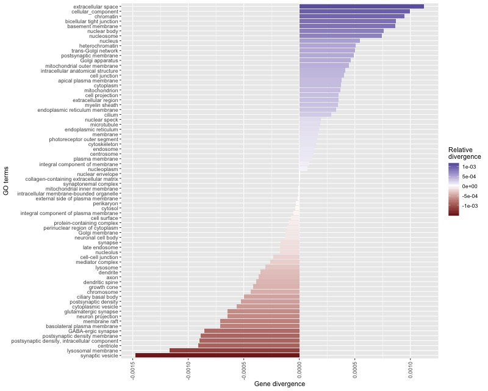

Session 8: Bioinformatic pipelines
==================================

Mouse Gene Ontology enrichment analysis pipeline
------------------------------------------------

Bioinformatic pipeline to carry Gene Ontology enrichment analysis for low 
and high divergence genes among two house mouse subspecies.

SNP variants for two mouse strains (PWD/PhJ, WSB/EiJ) were downloaded from 
the Mouse Genome Project FTP site (`Mouse Genome Project <https://www.sanger.ac.uk/data/mouse-genomes-project/>`_). 
PWD/PhJ and WSB/EiJ represent *Mus musculus musculus* and *Mus musculus 
domesticus* subspecies, respectively.

The aim is to identify genes with high relative divergence between the two strains 
and carry Gene Ontology enrichment analysis for genes according to the divergence.

First, you have to clone the repository from the GitHub:

.. code-block:: bash

	# Go to you project directory
	cd ~/projects

	# Clone repository
	git clone https://github.com/vjanousk/mouse-go-analysis.git

	# Go to the local repository
	cd mouse-go-analysis

Install required software
^^^^^^^^^^^^^^^^^^^^^^^^^

For the mouse Gene Ontology pipeline three specialized genomic tools are necessary:
``bedtools``, ``vcftools`` or ``bcftools``. If they are not installed, the script below will 
install these tools.

.. code-block:: bash
	
	./install.sh

Prepare directories
^^^^^^^^^^^^^^^^^^^

We are going to prepare directories that are use to store source data as well as 
intermediate steps and final resulting data. We will create a new ``data`` directory
in your project directory

.. code-block:: bash
	
	mkdir -p data/00-source-data data/01-divergence data/02-go

Define variables
^^^^^^^^^^^^^^^^

Several types of variables defined. Filtering parameters provide thresholds 
on filtering quality and number of genes used at different stages of the pipeline.

.. code-block:: bash
	
	# Filtering parameters
	quality=50
	readdepth=10
	minnumgenes=9

	# Working directories (removed from the git in .gitignore)
	wd_source=data/00-source-data
	wd_divergence=data/01-divergence
	wd_go=data/02-go

	# Source files
	sourcevcf=/data-shared/mouse_go/mgp.v5.snps.dbSNP142.clean.X.vcf.gz
	sourcegenes=/data-shared/mouse_go/MGI.gff3.gz
	go2genes=/data-shared/mouse_go/gene_association.mgi.gz
	goterms=/data-shared/mouse_go/go_terms.mgi.gz

	# Processed source files
	cds_db=$wd_source/mgi-cds.bed
	go_db=$wd_source/go2genes.txt

	# Divergence analysis output files:
	annotation=$wd_divergence/annotation.tab
	divergencevcf=$wd_divergence/out-vars.vcf
	divergence=$wd_divergence/divergence.bed

	# GO enrichment by high and low divergence regions
	div_go=$wd_go/divergence_by_go.txt

Prepare CDS & GO databases
^^^^^^^^^^^^^^^^^^^^^^^^^^

``MGI.gff3.gz`` represents a full report containing detailed information on genes, 
mRNAs, exons and CDS. For the divergence analysis only CDS are needed. CDS database 
is prepared in this step and ``.gff3`` is converted to ``.bed`` to work more easily with 
the CDS data.

.. code-block:: bash
	
	src/make_cds_database.sh $sourcegenes $cds_db

``go_terms.mgi.gz`` and ``gene_association.mgi.gz`` represents GO terms and association 
between genes and GO terms IDs provided by Mouse Genome Informatics 
(`Mouse Genome Informatics <http://www.informatics.jax.org>`_) and Gene Ontology 
Consortium (`Gene Ontology <http://geneontology.org>`_). In the command below joined 
dataset of list of genes with GO term enrichment is prepared.

.. code-block:: bash
	
	src/make_go_database.sh $go2genes $goterms $go_db

Run the pipeline step-by-step
^^^^^^^^^^^^^^^^^^^^^^^^^^^^^

**1. Selecting SNPs that are divergent between the two strains**

Other criteria used for selection is the PHRED quality and read depth (DP). 
Divergent SNPs are identified using Fst function built in the ``vcftools``. SNPs 
are considered to be divergent when Fst equals 1.

.. code-block:: bash
	
	src/get_divergent_variants.sh \
	$quality \
	$readdepth \
	$sourcevcf \
	$annotation \
	$divergencevcf

**2. Calculate the per gene divergence**

Once the list of divergent SNPs between the two strains and the CDS database are created, 
the divergence per gene can be calculated. Combination of ``bedtools`` tools and ``awk`` 
commands is used to find SNPs overlapping CDS parts of the genes and calculate sums 
and relative divergence by genes.

.. code-block:: bash
	
	src/calculate_per_gene_divergence.sh \
	$divergencevcf.gz \
	$cds_db \
	$divergence

**3. Calculate the average relative divergence by Gene Ontology category**

Per-gene relative divergences are used to calculate the average relative divergence 
for individual GO terms. Combinatino of the built-in Unix ``join`` and ``sort`` commands 
is used along with `groupby` that is part of the ``bedtools`` tools suite. GO dataset 
is joined to dataset on with gene relative divergences. The average for every GO term 
is then calculated omitting low prevalence GO terms.

.. code-block:: bash

	src/divergence_by_go.sh \
	$divergence \
	$go_db \
	$minnumgenes \
	$div_go

**4. Prepare a barplot showing results of the GO enrichment analysis**

To plot the results of the GO enrichment analysis ``Rscript`` is used. Library ``ggplot2`` 
is the most suitable tool to provide fast and efficient plot.

.. code-block:: bash
	
	Rscript src/plot.R

Alternatively, we can open the ``.R`` file in R Studio and plot the graph there.

Resulting ggplot graph
^^^^^^^^^^^^^^^^^^^^^^

Run the whole pipeline at once
^^^^^^^^^^^^^^^^^^^^^^^^^^^^^^

Now we can try to run the whole pipeline at once using ``pipeline.sh`` shell script.

.. code-block:: bash
	
	./pipeline.sh \
	$quality \
	$readdepth \
	$minnumgenes \
	$sourcevcf \
	$annotation \
	$divergencevcf \
	$cds_db \
	$divergence \
	$go_db \
	$div_go

