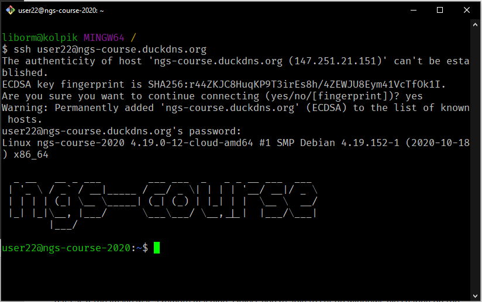
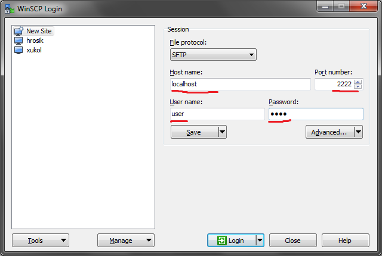

.. _ssh_connect:

Connecting to the remote machine
================================
To control the machine, you need to connect to the ssh service.
This is also referred to as 'logging in'.

.. note::
    You will need a user name and a password to log in. `Join our Slack
    <https://join.slack.com/t/ngs-course/shared_invite/zt-jfrs3pyd-n6pzUCosxXqvh4gcAIjpuw>`_
    so we can send the credentials to everyone during the course introduction.

In **Windows** this is done with ``Git Bash`` from the ``Git for Windows``
package. When you run it, you get a so-called `terminal window`. Use your user
name given in Slack (substitute the ``##`` with the number you got),
type the following command and press ``Enter``::

  ssh user##@ngs-course.duckdns.org

  # when asked about the 'authenticity', type yes
  The authenticity of host 'ngs-course.duckdns.org (147.251.21.151)' can't be established.
  ECDSA key fingerprint is SHA256:r44ZKJC8HuqKP9T3irEs8h/4ZEWJU8Eym41VcTfOk1I.
  Are you sure you want to continue connecting (yes/no/[fingerprint])? yes

Type in your password when prompted with ``user##@ngs-course.duckdns.org's password:``.
The password entry is 'silent', nothing appears as you type - so no one can see
how many characters your password has.

In **macOS** your terminal program is called 'Terminal', in **Linux** you have
several options like 'Konsole', 'xterm' etc.

On **Chromebook**, you need to run the
`Secure Shell App <https://chrome.google.com/webstore/detail/secure-shell-app/pnhechapfaindjhompbnflcldabbghjo?hl=en>`_.

Connect to copy files
---------------------
In Windows, WinSCP can be used to copy files to Linux machines.

In Mac OS X or Linux, the most simple command to copy a file into
a home directory of ``user##`` on a remote machine is::

  scp myfile user##@ngs-course.duckdns.org:~

Connect to RStudio
------------------
This is the easiest one, just click this link: `Open RStudio <https://ngs-course.duckdns.org>`_.
Login with the same credentials you got on Slack.
