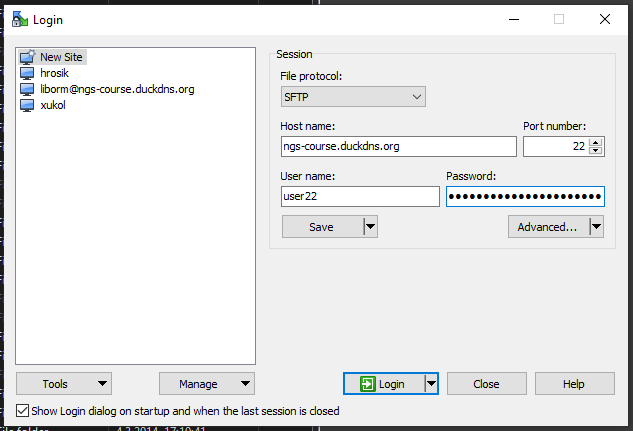

Connecting to the virtual machine
=================================
.. note::
  You need to start the virtual machine first!

.. _ssh_connect:

Connect to control the machine
------------------------------
To control the machine, you need to connect to the ssh service.
This is also referred to as 'logging in'.

In **Windows** this is done with ``Git Bash`` from the ``Git for Windows``
package. When you run it, you get a so-called terminal window. Type the
following command and press ``Enter``::

  ssh -p 2222 user@localhost

  # when asked about the 'authenticity', type yes
  The authenticity of host '[localhost]:2222 ([127.0.0.1]:2222)' can't be established.
  ECDSA key fingerprint is SHA256:txmEQW0xgqGF4u8lzWjaGJPXVni9yKNBOBN6FxWyCQU.
  Are you sure you want to continue connecting (yes/no)? yes

Type in your password when prompted with ``user@localhost's password:`` - it's
the same as the username - ``user``. The password entry is 'silent', nothing
appears as you type - so no one can see how many characters your password has.

.. image:: _static/win-terminal.png

In **Mac OS X** your terminal program is called 'Terminal', in **Linux** you have several options like 'Konsole', 'xterm' etc.

Testing the Internet connection
-------------------------------
When you're logged in, check your internet connection from the virtual machine. Your main
computer has to be connected to the internet, of course. Copy the following command, and
paste it to the command prompt (``shift+insert`` in terminal window).

.. code-block:: bash

  wget -q -O - http://goo.gl/n8XK2Y | grep '<title>'
  #                     <title>Seznam - najdu tam, co neznám</title>

If the ``<title>...`` does not appear, something is probably wrong with the connection.

Connect to copy files
---------------------
In Windows, WinSCP can be used to copy files to Linux machines.

In Mac OS X or Linux, the most simple command to copy a file into
a home directory of ``user`` on a running virtual machine is::

  scp -P 2222 myfile user@localhost:~

Connect to RStudio
------------------
This is the easiest one, just click this link: `Open RStudio <http://localhost:8787>`_.
Login with the same credentials (user, user).

