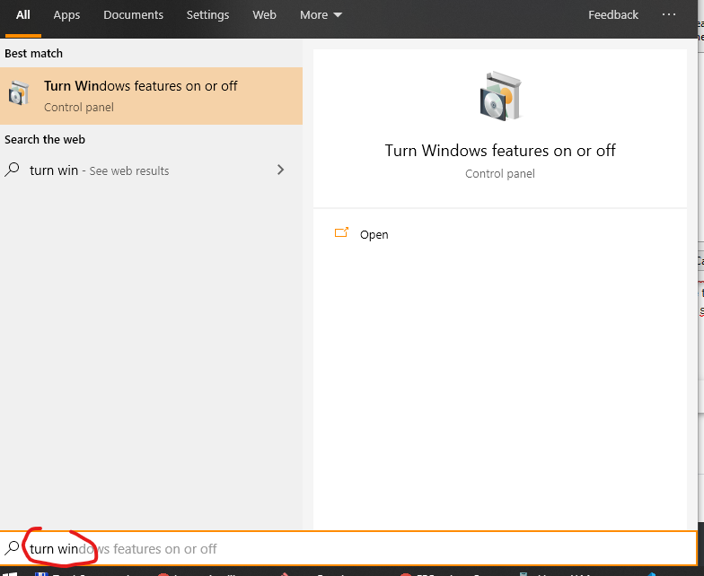
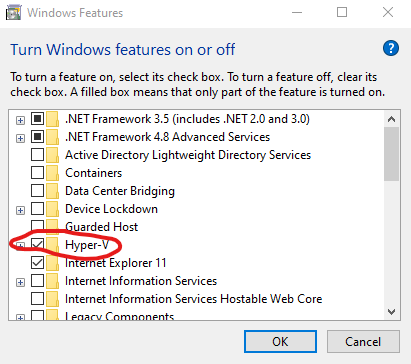

.. _win10_install:

Installation instructions for latest Windows 10
===============================================

We will be using a virtual computer pre-installed with Debian Linux and sample data necessary for the exercises.

VirtualBox does not work on some Windows 10 machines, as virtualization is used to imporove your security.

Installation steps (it should take about 20 minutes, use some good Internet link):

Install Hyper-V
---------------
Turn the `Hyper-V` feature on and restart as required.

Set up the machine
------------------

- Check that you can run `Hyper-V Manager` from start menu.
- Download the virtual machine image from this link: https://owncloud.cesnet.cz/index.php/s/BKV3jf8dYNjkq5K/download (~ 1.5 GB). You'll get a single
  file with ``.exe`` extension.
- Double click the ``.exe`` file, it will unpack itself. Then run `Hyper-V Manager` and choose
  `Import Virtual Machine`, select the folder you just unpacked.

How to access the machine
-------------------------
It is much more comfortable to use a native terminal application, rather than
the small 'monitor'.

Install `Git for Windows <https://git-scm.com/download/win>`_. We'll use it to
control the virtual computer.

Be sure to check ``Git Bash Here``, keep the default settings in the other screens.

.. image:: _static/git-for-win-1.png

.. image:: _static/git-for-win-2.png

To set up your terminal run the ``Git Bash`` from Start menu,
run this and exit the terminal (``exit``)::

  curl -sL https://owncloud.cesnet.cz/index.php/s/1B1NnrI4lqQtY9Q/download > ~/.minttyrc

Install `WinSCP <http://winscp.net/eng/download.php>`_ (look for
``Installation package``).  WinSCP will be used to transfer files between your
'host' computer and the virtual computer.

Time to log in!
---------------
We will help you to log in, because it's a little more complicated than with VirtualBox.
