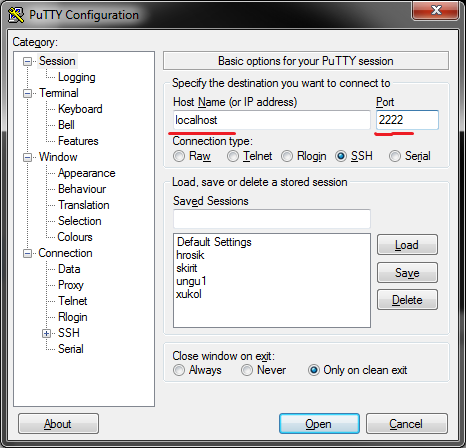
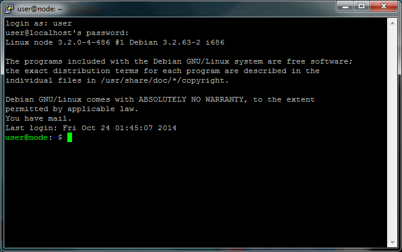

Installation instructions
=========================

We will be using a virtual computer preinstalled with Debian Linux. 

.. note:: 
  You need to install it even if your main system is Linux / Mac OS X!

To run it you need to install VirtualBox (https://www.virtualbox.org/wiki/Downloads). It works on Linux and Mac too.

After VirtualBox is installed, download and install the virtual machine image from this link: http://goo.gl/ofOtS9
Double click on the downloaded file and follow the instructions. It is a complete system, the installation takes just one minute. It even has the course data preinstalled.

Configuration details:

- Administrative user: root, password: debian
- Normal user: user, password: user
- ssh on port 2222
- RStudio on port 8787

Check whether you can start the virtual machine: click Start in the main VirtualBox window - you should see something like this after a while:

.. image:: _static/vbox.png

You don't need to type anything into that window, just checking that it looks ok is enough.

In case of any problems try to find me (Libor Morkovsky) in Nove Hrady, we'll try to resolve it before the course.

Windows
-------
Install PuTTY and WinSCP.

- PuTTY (http://www.chiark.greenend.org.uk/~sgtatham/putty/download.html - look for putty.exe) 
- WinSCP (http://winscp.net/eng/download.php - look for Installation package). 

Having the virtual machine started, try to connect: 

- start PuTTY
- Host Name: localhost
- Port: 2222
- click Open or press <Enter>

In the black wnidow that appears, type your credentials:

- login as: ``user``
- user@localhost’s password: ``user``

Mac OS X and Linux
------------------
Ssh should be built into your system. Start the terminal, and type::

  ssh -p 2222 localhost

For copying of files `lftp` is the best option. Mac users can use `CyberDuck`, if they prefer clickable tools.  
