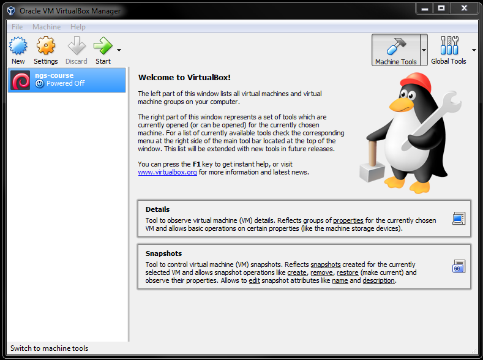
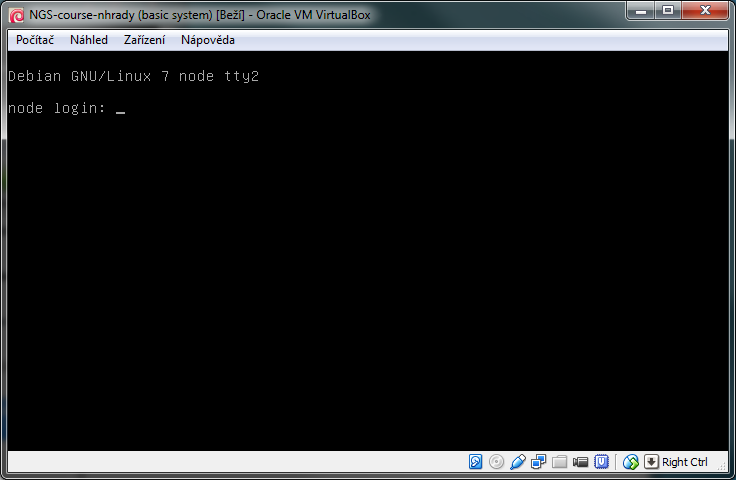
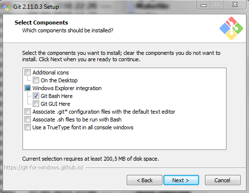
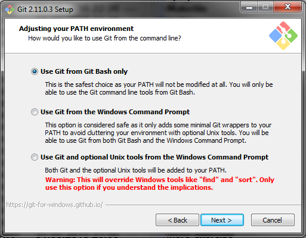

Installation instructions
=========================

We will be using a virtual computer pre-installed with Debian Linux and sample data necessary for the exercises.

.. note::
  You need to install the image even if your main system is Linux / Mac OS X!

Installation steps (it should take about 10 minutes, use some good Internet link):

- Install VirtualBox (https://www.virtualbox.org/wiki/Downloads). It works on Linux and Mac too.
- Download the virtual machine image from this link: https://owncloud.cesnet.cz/index.php/s/KVSdkqgCUuQiJvF (~ 1.5 GB). You'll get a single
  file with ``.ova`` extension.
- You can either double click the ``.ova`` file, or run VirtualBox, and choose ``File > Import Appliance``.
  Follow the instructions after the import is started.

After successful installation you should see something like this (only the machine list will contain just one machine).
Check whether you can start the virtual machine: click ``Start`` in the main VirtualBox window:

After a while you should see something like this:

You don't need to type anything into that window, just checking that it looks like the screen shot is enough.

How to access the machine
-------------------------
It is much more comfortable to use a native terminal application, rather than
the small VirtualBox 'monitor'. You will connect to the machine differently,
depending on what operating system you are using.

Windows
^^^^^^^
Install `Git for Windows <https://git-scm.com/download/win>`_. We'll use it to
control the virtual computer.

Be sure to check ``Git Bash Here``, keep the default settings in the other screens.

To set up your terminal run the ``Git Bash`` from Start menu,
run this and exit the terminal (``exit``)::

  curl -sL https://goo.gl/684ar0 > ~/.minttyrc

Install `WinSCP <http://winscp.net/eng/download.php>`_ (look for
``Installation package``).  WinSCP will be used to transfer files between your
'host' computer and the virtual computer.

Mac OS X and Linux
^^^^^^^^^^^^^^^^^^
Ssh is used to control the virtual computer. It should be already installed in your computer.

Files can be transferred with ``scp``, ``rsync`` or ``lftp`` (recommended)
from the command line. `Scp` and `rsync` could be already installed in your system,
if you want to use `lftp`, you'll probably have to install it yourself.

Mac users that prefer grapical clients can use something like `CyberDuck`. See
http://apple.stackexchange.com/questions/25661/whats-a-good-graphical-sftp-utility-for-os-x .

Time to log in!
---------------
Try to log in following the instructions in :ref:`ssh_connect`.
